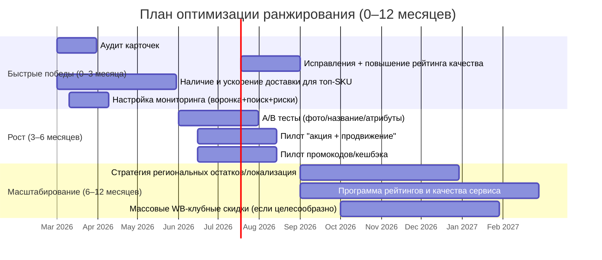

# Продвижение карточки : что реально влияет на ранжирование в 2026

## Резюме для руководителя

Я отвечу как руководитель практики e-commerce search/ranking и performance-оптимизации на маркетплейсах (фокус: LTR‑поиск, конверсия, логистика и коммерческие факторы).

По состоянию на **27 февраля 2026** наиболее “жёстко” подтверждённые факторы ранжирования (то есть прямо перечисленные в официальных материалах продавца с диапазонами влияния) распределяются так: **скорость/условия доставки и время сборки (30–40%)**, **участие в акциях (7–35% в период акции)**, **объём продаж в рублях (10–25%, приоритет — последние ~30 дней)** и **конверсионные показатели (5–20%)**. citeturn30view0turn30view3

Практический вывод: в 2026 победу в выдаче почти всегда дают не “SEO‑тексты”, а **связка “релевантность → кликабельность → конверсия → продажи → логистика/наличие”**, усиленная промо‑инструментами. Даже внутри одной категории веса и приоритеты могут меняться, а для новинок те же факторы применяются “с другим приоритетом” (например, продажи у новинки ещё отсутствуют). citeturn30view0

Самые важные рычаги, которые можно системно контролировать без доступа к внутреннему коду платформы:

- **Обеспечить релевантность и допуск в выдачу**: корректные бренд/характеристики/описание, отсутствие “недопустимой информации” и переспама, соответствующее фото (иначе товар может искатьcя/индексироваться хуже или быть понижен). citeturn30view0turn10view0turn12view1  
- **Ускорить доставку и снизить трение логистики**: модель продаж и качество выполнения (включая ограничения по “рейтингу доставки” для FBS/DBS/других моделей). citeturn30view0turn21view1turn21view2  
- **Управлять продажами и конверсией**: улучшение CTR/конверсий по воронке и рост “здоровой” продажи, без подозрительных операций (самовыкуп официально исключается из расчётов). citeturn30view3turn8view0  
- **Строить промо так, чтобы оно подкрепляло органику**: официально описан “дополнительный буст”, когда товар одновременно в акции и в кампании продвижения; эффект временный и работает только для релевантных запросов. citeturn30view0turn30view3  
- **Выжимать “малые, но стабильные” коэффициенты**: скидки WB‑клуба могут давать **+2% коэффициента ранжирования** при выполнении условий по доле ассортимента; в исследованиях продавца фиксируется рост продаж/заказов у товаров со скидкой. citeturn29view0turn30view3  

Ключевые риски и ограничения: (а) платформа прямо предупреждает, что “SEO‑хакерство” (ключевой спам, спецсимволы, перечисления форм слова, названия разделов) **не повышает** позиции и может ухудшать; (б) накрутки (самовыкуп, фейк‑отзывы) рассчитываются как подозрительные/исключаемые; (в) карточки могут быть **скрыты/заблокированы** из каталога из‑за контента/контрафакта или из‑за низкого рейтинга магазина. citeturn30view0turn30view3turn13view0  

## Методология и уровень достоверности

Опора отчёта — первичные источники: официальные инструкции продавца на entity["organization","WB Partners","seller portal"] (обновления 2025–2026), официальная документация entity["organization","WB API","wildberries developer platform"] (методы/ограничения полей и сущностей карточки), а также связанные инструкции по аналитике, рейтингу, логистике и промо‑инструментам. citeturn29view2turn10view0turn16view3turn8view0turn23view3  

Для выделения “что реально влияет” я разделяю факторы на три класса:

- **Подтверждено** — фактор явно назван как влияющий на ранжирование (и/или имеет диапазон влияния, коэффициент, формулу/правило ограничения). citeturn30view3turn19view0turn21view1turn29view0  
- **Косвенно подтверждено** — фактор вытекает из описанного механизма (например, локализация остатков влияет на скорость доставки/логистику → а скорость доставки — ключевой фактор ранжирования), но прямой “вес” не раскрыт. citeturn21view0turn30view0  
- **Гипотеза/обобщение** — вывод на основе академических работ по e‑commerce LTR и индустриальных A/B‑кейсов (CTR/CVR/контекст, мультимодальность), применимый как объяснение вероятной архитектуры, но не как “точный алгоритм” конкретной платформы. citeturn26view1turn27search4turn27search12turn27search8  

Ограничение: нет доступа к внутренним моделям/весам по конкретным запросам, поэтому любые “ранжирующие коэффициенты, не опубликованные официально”, отмечаются как неизвестные. citeturn30view0turn19view0  

## Подтверждённые факторы ранжирования в 2026

### Что поиск считает релевантным и что может “уронить” карточку

Официально описано, что товар попадает в выдачу, когда соответствует запросу; при этом запрос **не обязан совпадать дословно** с текстом карточки, а поиск анализирует информацию в карточке и поведение пользователей. Для “брендового контекста” поиск, как правило, смотрит поле **«бренд»**. citeturn30view0  

Отдельно подчёркнуто, что алгоритмы отличают допустимую и недопустимую для карточки информацию; недопустимая может понижать позиции (упоминание других брендов, множественное перечисление ключевиков, нерелевантная информация). Также перечислены “методы, которые не повышают место” (спам формами слов, спецсимволы, названия разделов, дубли слова). citeturn30view0  

### Официальная “матрица влияния”: веса, где они раскрыты

Ниже — таблица факторов, где влияние раскрыто официально (диапазоны/пороговые правила), и как это переводится в управляемые действия.

| Фактор | Официальное влияние/правило | Оценка влияния (2026) | Какие данные нужны | Рекомендуемые действия (кратко) |
|---|---:|---|---|---|
| Зоны доставки, время сборки и доставки | **30–40%** citeturn30view0 | High | среднее время доставки/сборки, география остатков и заказов citeturn8view0turn21view2 | ускорять доставку (модель/склады/остатки), снижать время сборки, держать наличие |
| Участие в акциях | **7–35%** на период акции; для масштабных акций до 35% citeturn30view0turn30view3 | High (в период) | участие/условия акции, цена/скидка, качество карточки citeturn30view0turn12view1 | выбирать акции с маржинальным запасом; готовить остатки; избегать “плохой” конверсии в промо |
| Доп. буст: акция + продвижение | повышенный коэф. ранжирования при одновременном участии; работает для релевантных запросов; пример подъёма позиции приведён официально citeturn30view0turn30view3 | High (как усилитель) | участие в акции + активная кампания продвижения | синхронизировать акцию и продвижение на 2–4 недели, “качать” релевантные кластеры |
| Объём продаж (₽) | **10–25%**; продажи за последний месяц важнее; возвраты/отказы не учитываются; подозрительные операции (самовыкуп) исключаются citeturn30view3 | High | продажи по дням/неделям, выкупы, возвраты, наличие размеров citeturn8view0turn30view3 | наращивать “здоровую” продажу (цена/промо/логистика), не допускать OOS, не использовать накрутки |
| Конверсия | **5–20%**; конверсии могут быть в показ/переход/заказ/покупку; “часто показывается, но редко продаётся” — нет смысла держать в топе citeturn30view3turn8view0 | Medium–High | показы → клики/переходы → корзина → заказы → выкупы citeturn8view0turn19view0 | повышать CTR и CVR, устранять причины отказов и возвратов, улучшать фото/характеристики |
| Рейтинг продавца | **3–10%**; включает отзывы (до 4%) и внутренний рейтинг, зависящий от доставки/выкупа/возвратов/%брака и др. citeturn30view3turn7view0 | Medium | рейтинг продавца, показатели сервиса (вовремя доставили, выкуп и т.п.) citeturn7view0 | предотвращать операционные сбои; работать с негативом; улучшать качество сервиса |
| Опция “Повышение позиции…” | до **3%** улучшения ранжирования citeturn30view3turn19view0 | Low–Medium | подключение опции | использовать как “добавку” только после устранения базовых ограничений |
| Рейтинг товара и отзывы | **1–10%**; учитываются только честные оценки, накрутка распознаётся и удаляется citeturn30view3turn7view0 | Medium | рейтинг товара, динамика отзывов/оценок | повышать качество товара/ожиданий, стимулировать отзывы легально |
| Уровни продавцов | **1–2%** (бронза 1%, серебро 1.5%, золото 2%) citeturn30view3 | Low | уровень программы | добирать как “системный бонус”, не как основной драйвер |
| Наполнение карточки | до **1%**; качество контента повышает доверие и вероятность покупки citeturn30view3turn10view0 | Low (но базово необходимо) | рейтинг карточки/качество фото/ошибки контента | закрывать все ключевые поля, избегать штрафов за контент |
| Скидка WB‑клуба | до **2%** улучшения при выполнении условия по доле товаров + скидке citeturn30view3turn29view0 | Low–Medium (стабильный коэф.) | доля ассортимента с клубной скидкой | массово включать на достаточную долю SKU, особенно на “драйверы спроса” |

Важно: официально упоминается, что **одни и те же факторы могут иметь разный приоритет в разных категориях**, и для новинок приоритеты отличаются. citeturn30view0  

### Изменения и “движущиеся части” алгоритма, которые реально важны в 2026

Две подтверждённые “динамические” зоны, из‑за которых стратегия должна быть итеративной:

1) **Рейтинг качества карточки**: прямо сказано, что рейтинг влияет на позицию, и что алгоритмы обнаружения ошибок и качество рейтинга “постоянно дорабатываются”, поэтому рейтинг может меняться даже без правок карточки. citeturn10view0  

2) **Динамическая оценка факторов в аналитике поиска**: в отчёте “Поисковые запросы: ваши товары” платформа указывает, что анализирует 7 факторов ранжирования (рейтинг товара, рейтинг продавца, конверсия, логистика, участие в акциях, опция повышения позиции, объём продаж) — и эти статусы/рекомендации могут отличаться по карточке и по запросам. citeturn19view0turn18view0  

## Оптимизация карточки: атрибуты, контент, медиа, цена, наличие, метаданные

Ниже — “контентный слой” и то, как он превращается в ранжирование (через релевантность/допуск, CTR/CVR, отзывы/сервис).

### Визуальная опора

image_group{"layout":"carousel","aspect_ratio":"16:9","query":["Wildberries пример карточки товара фото превью","WB Продвижение кабинет конкурентная ставка скриншот","Wildberries брендовая полка пример в поиске","Wildberries выдача поиска товары пример"],"num_per_query":1}

### Наименование, бренд, описание: “SEO” как релевантность, а не как спам

Официально рекомендовано оптимизировать контент карточки, потому что на позицию влияют **наименование, описание и характеристики**. citeturn12view0turn30view0  

**Наименование (title)**: предлагается подбирать релевантные ключевые слова, но избегать синонимов/дублирования и словосочетаний, неверно описывающих товар. citeturn12view0turn12view1  
Техническое ограничение через API: поле `title` имеет ограничение длины (в API‑документации — до 60 символов для соответствующего поля). citeturn16view3  

**Бренд**: платформа прямо указывает, что при бренд‑контексте поиск “скорее всего” ищет информацию в поле «бренд». Поэтому корректный бренд = условие для бренд‑запросов и фильтров. citeturn30view0turn12view1  

**Описание**: рекомендуется подробное описание с пользой/особенностями и органичным включением ключевых слов, плюс проверка орфографии/стиля. citeturn12view0  
Одновременно официально показано, что переспам ключевиками и “бессвязные” перечисления ухудшают качество карточки и могут снижать позицию. citeturn10view0turn30view0  

### Характеристики, спецификации и категория: влияние через фильтры и “право быть показанным”

Правильно заполненные уникальные значения в соответствующих полях нужны, чтобы карточки “хорошо индексировались системой” и были видны в поиске и фильтрах. citeturn12view1  
Отдельно подчёркнуто: противоречивые характеристики могут привести к тому, что товар не попадёт в нужный раздел каталога/фильтр. citeturn12view1turn10view0  

API‑документация усиливает это технически: создание карточки предполагает выбор категорий/предмета и набора характеристик, а значения для ряда характеристик берутся из справочников; характеристики передаются как структурированное поле. citeturn16view0turn16view3turn15view0  

Практически для 2026 это означает: “семантика” на маркетплейсе — это не только текст, но и **структурные атрибуты**, потому что покупатель часто отсекает выдачу фильтрами (размер, материал, назначение и т.п.), а отчёт по качеству карточки прямо упоминает корректность характеристик как фактор, влияющий на показ по запросам/фильтрам. citeturn10view0turn12view1  

### Фото и видео: связь “превью → CTR → конверсия → ранг”

Платформа явно утверждает: фото должно **точно** соответствовать товару (нельзя показывать “похожие брюки”, нужно показать именно продаваемые). citeturn30view0  
В рейтинге качества карточки отдельно выделяется первое фото как “лицо”: оно показывается на превью в поиске и рекомендациях; плохой контент (в т.ч. фото) даёт штрафные баллы и снижает рейтинг карточки, что ухудшает позиции. citeturn10view0  

### SKU/артикулы и техполя: не “фактор ранга”, но фактор управляемости и чистоты данных

В API‑схемах карточки присутствуют поля `vendorCode` (артикул продавца) и `nmID` (артикул/идентификатор площадки), а также структурные размеры/штрихкоды; корректность этих связок важна для обновлений, наличия, цен на размеры и корректного учёта продаж по доступным размерам. citeturn16view3turn30view3  

### Цена, скидки, бейджи и “привлекательность” карточки

Цена как таковая не раскрыта как отдельный “вес”, но платформа связывает успех в акциях с “оптимальной ценой при должном качестве” и фиксирует, что часть скидок/механик делает карточку заметнее (например, кешбэк). citeturn30view0turn23view1  

С точки зрения измеримых эффектов в 2026, два механизма имеют прямые коэффициенты/исследования:

- **Скидки WB‑клуба**: при выполнении условий применяется **дополнительный коэффициент ранжирования 2%**, и отдельно описано суммирование процентов ранжирования с акциями. citeturn29view0turn30view3  
- **Кешбэк**: прямо сказано, что это вариант скидки, который делает карточку заметнее в каталоге; в материале заявлено, что продажи товаров с кешбэком “могут вырасти до 10%”. citeturn23view1  

## Поведенческие и операционные метрики: что измерять и чем реально управлять

### Воронка и метрики, которые платформа считает “официально”

В аналитике продавца описан отчёт по воронке, где фиксируются последовательные этапы поведения: показы → переходы в карточку и CTR → конверсия в корзину → заказы → выкуп/отмена/возврат, а также даются формулы расчётов конверсий (например, конверсия в корзину = добавления в корзину / переходы в карточку). citeturn8view0  

В отчёте “Поисковые запросы: ваши товары” дополнительно вводится “видимость” как вероятность того, что пользователь увидит товар в поиске (расчёт учитывает среднюю позицию), и показывается, что позиции учитываются по тем позициям, из которых были переход/добавление в корзину. citeturn18view0turn19view0  

Это важно методически: **часть “ранжирующих” метрик определяется не просто показами, а показами, которые привели к действию** — значит, оптимизация должна быть не “на показы любой ценой”, а на релевантный показ → действие. citeturn19view0turn30view3  

### CTR, конверсия, продажи: как они входят в ранжирование

Официально “конверсия” названа фактором ранжирования с влиянием 5–20%, причём разделены типы конверсий (в показ, в переход, в заказ, в покупку). citeturn30view3  
“Объём продаж” — 10–25%, с приоритетом последних ~30 дней и исключением возвратов/отказов; подозрительные операции (самовыкуп) исключаются из расчёта. citeturn30view3turn8view0  

Практический вывод (подтверждённый логикой e‑commerce LTR в академической литературе): платформы обучают и оптимизируют ранжирование по сигналам вовлечённости и пост‑клика (CTR/CVR, покупки), поскольку ручная разметка релевантности для всех запросов невозможна; используются “шумные” метки из пользовательского поведения (клики/просмотры/покупки). citeturn26view1turn27search4turn27search12  

### Отзывы, рейтинг товара, рейтинг продавца, Q&A: влияние через доверие и сервис

Рейтинг товара и отзывы — отдельный фактор с влиянием 1–10%, и отдельно указано, что накрученные отзывы распознаются и удаляются из расчёта. citeturn30view3  

Рейтинг продавца обновляется дважды в день; рассчитывается на основе оценок покупателей, приоритет отдаётся свежим оценкам (через коэффициент затухания), учитываются валидные отзывы и исключается спам/оскорбления/подозрительные отзывы. citeturn7view0turn7view1  
Также в официальной казахстанской версии правилами описаны пороги, при которых товар может быть скрыт из выдачи при комбинации низкого рейтинга продавца и отсутствия/низкого рейтинга товара (это важно как риск‑контроль даже если условия локализованы по стране). citeturn7view1  

Операционно это связывается с ранжированием двумя линиями:

- официально рейтинг продавца входит в фактор 3–10% и зависит от показателей сервиса, включая сроки доставки/процент выкупа/возвраты/брак и др.; citeturn30view3turn7view0  
- карточки могут быть скрыты из каталога при низком рейтинге магазина (это отражено в отчёте “Скрытые товары”). citeturn13view0  

### Логистика, модель продаж, отмены и требования к качеству выполнения

Самый “тяжёлый” фактор — зоны доставки/сборка/доставка (30–40%), т.е. **операционная способность быстро отдать товар** встроена в ранжирование. citeturn30view0  

Модель продаж влияет на достижимость этой цели. Например, преимущества модели поставки на склад платформы описываются как более широкая география и быстрая скорость доставки “с ближайших складов”. citeturn21view2  

Для моделей, где продавец отвечает за выполнение (в т.ч. FBS и др.), вводится “рейтинг доставки”: расчёт ежедневно, по данным за последние 365 дней; при падении ниже порога платформа временно ограничивает возможность получать новые заказы по конкретной модели (отдельные пороги для разных моделей). citeturn21view1  

Это напрямую связано с ранжированием (логистика как фактор) и косвенно — с продажами/конверсией (если модель ограничена, вы теряете заказы → ухудшается объём продаж/конверсия). citeturn21view1turn30view3  

### Распределение остатков, локализация, “сезонность” и давность сигналов

**Фактор времени** подтверждён в двух местах:

- продажи “за последний месяц” важнее, чем в предыдущих месяцах; citeturn30view3  
- в расчёте рейтинга продавца свежие оценки имеют больший вес (затухание), а исторические оценки со временем теряют влияние. citeturn7view0  

Сезонность официально предлагается анализировать через отчёт по поисковым запросам (что ищут покупатели, какие фразы ведут к заказам) и через отчёт по поисковым запросам ваших товаров (позиции/видимость/факторы по запросам). citeturn18view1turn18view0turn12view0  

Распределение остатков по регионам напрямую связано с доставкой: индекс локализации описывает, насколько эффективно вы распределяете остатки по складам, чтобы товар был ближе к покупателю (локальный заказ — в пределах одного макрорегиона); сам индекс напрямую влияет на стоимость логистики. citeturn21view0  
Поскольку скорость/время доставки — топ‑фактор ранжирования, улучшение локализации — **косвенно подтверждённый** рычаг через ускорение доставки (вес локализации как фактора ранга не раскрыт). citeturn21view0turn30view0  

## Промо и платные инструменты: что даёт измеримый эффект и как не “сжечь” органику

### Акции и “флэш‑распродажи”: самый крупный официальный рычаг после логистики

Участие в акциях имеет официальное влияние 7–35% в период действия акции. citeturn30view0  
Ключевой нюанс 2026: официально описан “дополнительный буст” при одновременном участии в акции и кампании продвижения; приведён пример кратного роста позиции (внутренний кейс платформы), при этом буст действует только на релевантные запросу товары и исчезает после окончания промо. citeturn30view0turn30view3  

### Реклама и продвижение: как измерять и как связывать с ростом ранга

По официальной логике продвижения, показы могут идти в разных зонах (поиск, каталог и рекомендации), но попадание в поиск и рекомендации привязано к релевантности характеристик/описания и к алгоритмическому подбору блоков (“похожие по фото”, “похожие по описанию и характеристикам”, “с этим товаром искали” и т.п.). citeturn5view0  

Ставочная логика “WB Продвижение” описывает минимальную/конкурентную ставки и “ставку лидеров”, причём конкурентная ставка вычисляется на основе ставок продавцов на похожие товары и показов/кликов (те, по которым показов не было, в расчёт не берутся). citeturn6view0  

Измерение рекламного эффекта подтверждено через инструкции статистики: в кабинете рекламы доступны метрики показов, кликов, CTR и т.п., и отдельно указана возможность видеть статистику по креативам (удобно для A/B‑тестов креативов). citeturn23view2  

Практическое правило 2026: реклама помогает рангу **только если она улучшает “ранжирующие” поведенческие сигналы — продажи и конверсии**, иначе вы “покупаете показы”, но получаете слабую конверсию (и официально это прямой аргумент против держания товара в топе). citeturn30view3turn8view0turn19view0  

### Sponsored‑размещения и бренд‑инструменты

“Брендовая полка” — официальный рекламный блок, который появляется **на 6‑й строке выдачи в мобильном приложении** по подходящим поисковым запросам; это прямой инструмент захвата внимания на SERP. citeturn23view3  

### Купоны/промокоды: влияние через цену, конверсию и внешнюю доставку трафика

Промокоды продавца — бесплатный инструмент: вы создаёте акцию, задаёте срок и скидку, система генерирует промокод; далее вы распространяете код во внешних каналах (рассылки, соцсети, блогеры и т.п.). citeturn23view0  
Так как официальные факторы ранжирования включают конверсию и продажи, эффект промокодов на ранжирование идёт через рост заказов/выкупов и улучшение конверсий по воронке. citeturn23view0turn30view3turn8view0  

### Кешбэк и WB‑клуб: редкие случаи, когда “визуальный бейдж” подкреплён исследованиями и коэффициентами

Кешбэк описан как механизм, делающий карточку заметнее в каталоге, и в официальном материале прямо заявлено, что продажи товаров с кешбэком “могут вырасти до 10%”. citeturn23view1  

WB‑клуб: официально описано (а) что подписка запущена в 2024 и к сентябрю 2025 у неё >3 млн активных пользователей; (б) что товары со скидкой WB‑клуба можно найти фильтром в поиске; (в) что при скидке от 5% на ≥50% карточек применяется **+2% коэффициент ранжирования**, с возможностью суммирования с акционным ранжированием. citeturn29view0turn30view3  

В исследованиях платформы зафиксировано, что продажи товаров со скидками WB‑клуба в среднем выросли, подписчики чаще оставляют отзывы, а также дана таблица зависимости роста заказов от процента клубной скидки. citeturn29view0  

## Метрики, эксперименты и дорожная карта улучшений

### Что мониторить ежедневно и еженедельно

Оптимальный “контур контроля” должен совпадать с тем, что платформа использует как факторы и что даёт в отчётах:

- **Показы, переходы, CTR, конверсия в корзину и в заказ, выкупы/отмены/возвраты** — по карточке и динамике (воронка). citeturn8view0  
- **Средняя позиция, видимость в поиске, факторы позиций по карточке и по запросам** (особенно 7 анализируемых факторов: рейтинг товара, рейтинг продавца, конверсия, логистика, акции, опция повышения, объём продаж). citeturn19view0turn18view0  
- **Среднее время доставки и доля локальных заказов** (как управляемый компонент логистического фактора). citeturn8view0turn21view0  
- **Рейтинг товара и рейтинг продавца** (с учётом того, что свежие оценки имеют больший вес). citeturn7view0turn30view3  
- **Статусы “скрыто/заблокировано”** и причины (контент/контрафакт/низкий рейтинг магазина). citeturn13view0turn12view2  
- **Рекламные метрики по кампаниям/креативам (показы, клики, CTR и др.)** — для связи “реклама → поведение → продажи”. citeturn23view2turn18view2  

### Рекомендуемые A/B‑тесты в 2026

Ниже — набор тестов, которые напрямую воздействуют на официальные факторы (конверсия/продажи/логистика/контент). Длительность теста зависит от трафика; главное — фиксировать сезонность и не запускать тест в период резких изменений остатков/цен без контроля. citeturn8view0turn30view3turn18view1  

| Тест | Гипотеза | Основная метрика успеха | Guardrails (чтобы не сломать) | Что нужно подготовить |
|---|---|---|---|---|
| Главное фото (превью) A vs B | улучшение читаемости/соответствия товару увеличит CTR и конверсию | CTR из выдачи, конверсия в корзину citeturn8view0turn10view0 | возвраты/отказы, рейтинг товара citeturn30view3turn7view0 | 2 варианта фото без запрещённых надписей; контроль качества |
| Наименование (ключевая фраза) | более точное ядро запроса повысит релевантность и попадание в кластеры | видимость/средняя позиция по запросам, CTR citeturn19view0turn12view0 | падение конверсии в заказ/покупку | семантика по отчётам поисковых запросов citeturn18view1turn12view0 |
| Характеристики (критичные фильтры) | корректные атрибуты расширят показы в фильтрах и увеличат CR | рост показов “по фильтрам” → конверсия в заказ citeturn12view1turn30view3 | рост возвратов из‑за неверных ожиданий | аудит атрибутов по топ‑фильтрам категории |
| Цена/скидка (без ухудшения маржи) | снижение цены или участие в акции повысит продажи/ранг | продажи (₽) и заказы из поиска citeturn30view3turn19view0 | маржа, возвраты | расчёт юнит‑экономики и готовность остатков |
| Синхронизация акция + продвижение | “доп. буст” даст более высокий ранг и больше продаж | средняя позиция/видимость, продажи citeturn30view0turn30view3 | ROAS/перерасход бюджета | релевантные запросы + стабильные остатки |

### Приоритизированный чек‑лист и план 0–12 месяцев

Оценка “Ожидаемый эффект” ниже привязана к официальным диапазонам влияния (где они раскрыты) и к тому, что эти факторы видны в аналитике поиска как основные. citeturn30view3turn19view0  

| Горизонт | Что сделать | Усилие | Ожидаемый эффект | Почему это должно сработать |
|---|---|---:|---:|---|
| 0–3 месяца | Привести карточку к “допуску”: убрать спам/ошибки, заполнить ключевые характеристики, улучшить главное фото | Medium | High | релевантность + качество карточки влияет на позицию; недопустимая инфа понижает; первое фото влияет на превью/CTR citeturn30view0turn10view0turn12view1 |
| 0–3 месяца | Обеспечить наличие и ускорение доставки для топ‑SKU | High | High | логистика/время доставки — 30–40% citeturn30view0turn21view2 |
| 0–3 месяца | Настроить мониторинг: воронка + аналитика поиска + отчёт “скрытые товары” | Low–Medium | Medium | ранжирование зависит от конверсии и продаж; скрытия/блокировки убивают выдачу citeturn8view0turn19view0turn13view0 |
| 3–6 месяцев | Запустить системную работу по конверсии: A/B тест главного фото и наименования + оптимизация описания | Medium | Medium–High | конверсия — 5–20%; отчёты дают формулы/метрики по этапам citeturn30view3turn8view0turn12view0 |
| 3–6 месяцев | Выстроить “акция + продвижение” для 10–30 ключевых SKU (пилот) | High | High (в период) | официально описан доп. буст; акция сама до 35% citeturn30view0turn30view3 |
| 3–6 месяцев | Включить кешбэк/промокоды на ограниченный набор SKU и измерить инкремент | Medium | Medium | кешбэк делает карточку заметнее; заявлен рост продаж до 10% citeturn23view1turn23view0 |
| 6–12 месяцев | Масштабировать складскую/локализационную стратегию под регионы спроса | High | High | ускорение доставки — топ‑фактор; локализация улучшает близость товара к покупателю citeturn30view0turn21view0 |
| 6–12 месяцев | Системно улучшать рейтинг продавца и товара (операции, работа с негативом, качество) | High | Medium | рейтинг продавца 3–10%, рейтинг товара 1–10%, и есть пороговые риски скрытия по рейтингам citeturn30view3turn7view0turn7view1 |
| 6–12 месяцев | Массово использовать WB‑клубные скидки при выполнении условия по доле ассортимента | High | Medium | подтверждён +2% коэффициент ранжирования + исследования по росту заказов/продаж citeturn29view0turn30view3 |

### Таймлайн 0–12 месяцев (Mermaid)



### Контур оптимизации (flowchart)

```mermaid
flowchart TD
    A[Сбор данных: Поиск/Воронка/Рейтинги/Логистика] --> B{Карточка допущена в выдачу?}
    B -- Нет --> B1[Убрать недопустимый контент и спам\nЗаполнить характеристики\nУлучшить главное фото]
    B1 --> A

    B -- Да --> C{Что ограничивает рост?}
    C -->|Логистика/скорость| C1[Модель продаж + остатки + SLA\nЦель: быстрее доставка/сборка]
    C -->|Конверсия| C2[Гипотезы: фото/название/атрибуты/цена\nA/B тесты]
    C -->|Продажи| C3[Акции/цена/ассортимент\nУдержать маржу и наличие]
    C -->|Рейтинги| C4[Качество товара, работа с отзывами,\nоперации без сбоев]

    C2 --> D[Запуск промо: акция + продвижение\n(если релевантно)]
    C1 --> D
    C3 --> D
    D --> E[Мониторинг: позиция/видимость/воронка/ROI]
    E --> A
```

## Топ источников и оговорки об неопределённостях

### Приоритетные источники

1) Официальная инструкция “Выдача и ранжирование товаров…” (веса факторов, правила по спаму, NEW‑значок, самовыкуп, доп. буст). citeturn30view0turn30view3  
2) “Рейтинг качества карточки” (влияние на выдачу, штрафы за контент, изменчивость алгоритма рейтинга). citeturn10view0  
3) “Отчёт Поисковые запросы: ваши товары” (видимость, средняя позиция, анализ 7 факторов ранжирования в интерфейсе). citeturn19view0turn18view0  
4) “Отчёт Воронка продаж…” (метрики воронки и формулы конверсий, связь показов с рекламой). citeturn8view0  
5) “Рейтинг продавца” (как считается, частота обновления, борьба со спамом, затухание свежести). citeturn7view0turn7view1  
6) “Рейтинг доставки” (пороговые ограничения по моделям, ежедневный расчёт, риск блокировок). citeturn21view1  
7) “Как скидки WB‑клуба влияют на рост продаж” (коэффициент ранжирования 2%, исследования по росту продаж/отзывов). citeturn29view0  
8) “Промокоды продавца” и “Кешбэк” (механика скидок и заявленные эффекты на продажи/заметность). citeturn23view0turn23view1  
9) Документация WB API по карточкам (структура карточки, ограничения полей, работа с характеристиками/тегами/медиа). citeturn16view0turn16view3turn15view0  
10) Академические обзоры/кейсы по e‑commerce LTR (почему CTR/CVR/покупки используются как сигналы и как улучшения ранжирования дают инкремент в A/B). citeturn26view1turn27search4turn27search12turn27search8  

### Что остаётся неизвестным (и как с этим жить)

Весовые коэффициенты в официальной инструкции даны диапазонами и прямо оговорено, что **приоритет факторов зависит от выдачи и категории**, поэтому “универсальной формулы” по запросам нет. citeturn30view0  
Также часть специализированных материалов по ранжированию в акциях может быть доступна только в закрытом контуре продавца, поэтому в отчёте используются только общедоступные официальные формулировки и примеры. citeturn30view0turn12view2  

Главная практическая стратегия при такой неопределённости — не искать “секретный вес ключевика”, а **строить измеримый цикл**: релевантность/качество карточки → операционная скорость → промо‑ускорители → мониторинг позиций/видимости/воронки → A/B‑итерации. citeturn19view0turn8view0turn10view0